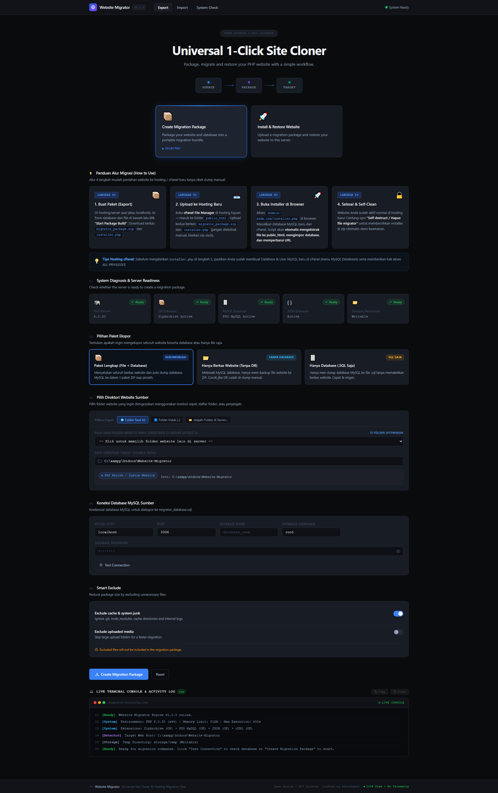
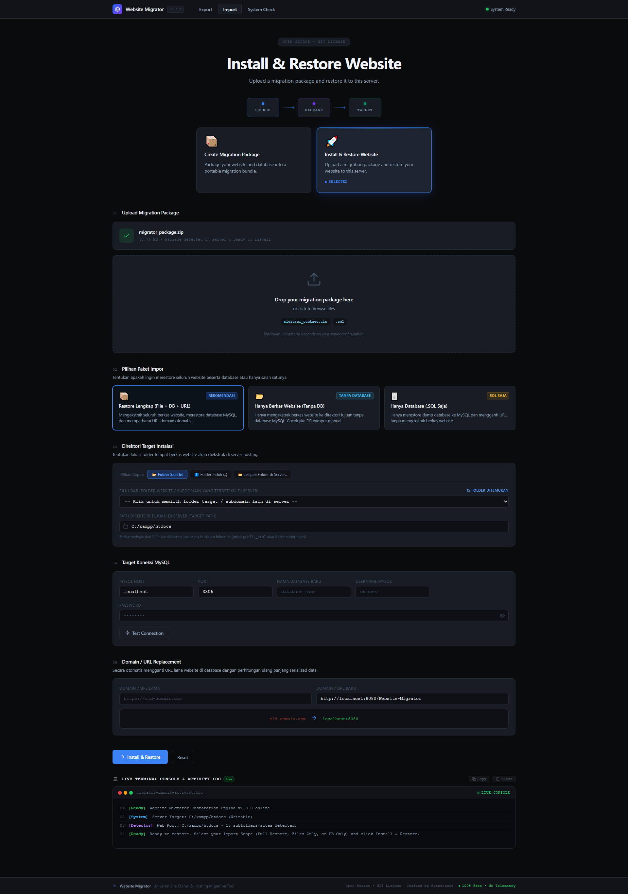
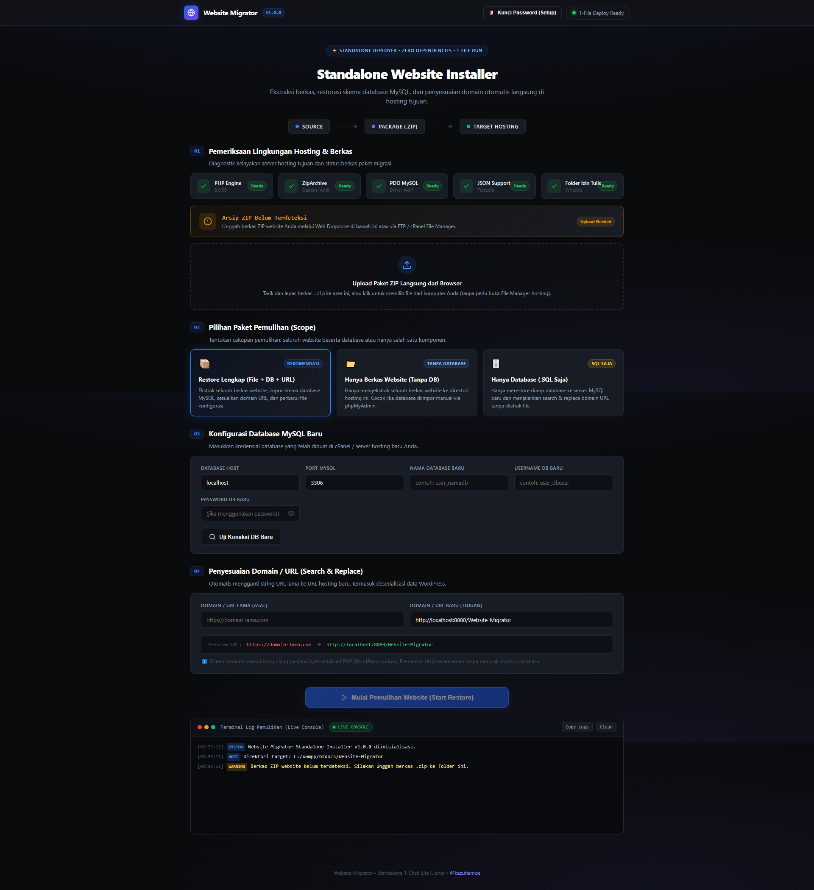

<div align="center">

# 📦 Website Migrator & Site Cloner

**Tools Universal 1-Klik Pindahan Website & Database MySQL Antar Hosting, cPanel, & Localhost.**

[](LICENSE)
[](https://php.net)
[](SECURITY.md)
[-6366f1?style=for-the-badge)](https://github.com/kazuhamoe/Website-Migrator)

<br/>

**[English](README.md)** &bull; **[Bahasa Indonesia](README.id.md)**

<p align="center">
  Aplikasi PHP ringan, transparan, dan tanpa ketergantungan framework luar untuk memindahkan seluruh berkas website dan database MySQL antar server tanpa kendala timeout, batasan memori RAM, atau plugin berbayar.
</p>

<br/>

<p align="center">
  
</p>

</div>

---

## 📸 Tangkapan Layar (Screenshots)

| 1. Dashboard Ekspor (`index.php`) | 2. Impor & Pemulihan (`import.php`) |
| :---: | :---: |
|  |  |

<div align="center">
  <h3>3. Standalone 1-File Installer (<code>installer.php</code>)</h3>
  
</div>

---

## 💡 Mengapa Website Migrator Dibuat?

Memindahkan website antar penyedia hosting atau dari localhost (XAMPP/Laragon) ke cPanel hosting sering kali mengalami masalah:
- **Timeout Batas Server Shared Hosting:** Script impor biasa sering macet saat melewati `max_execution_time` (biasanya hanya 30 detik).
- **Pengaturan WordPress Rusak:** Mengganti domain secara asal-asalan merusak data ter-serialisasi PHP (`s:length:"value";`) di database `wp_options`.
- **Plugin Migrasi Berat & Berbayar:** Banyak plugin yang membatasi ukuran backup maksimal 512MB jika tidak berlangganan premium.

**Website Migrator** mengatasi semua masalah tersebut dengan alur kerja cerdas:
1. **Packager (`index.php` di Server Asal):** Otomatis mendeteksi CMS/framework, mengekspor database MySQL baris demi baris via streaming, mengabaikan file cache sampah, dan membungkusnya menjadi satu arsip.
2. **Standalone Installer (`installer.php` di Server Tujuan):** File installer mandiri (hanya 1 file) yang mengekstrak ZIP secara bertahap, mengimpor database dalam potongan batch via AJAX (anti timeout), menyesuaikan domain baru secara aman, dan memiliki tombol self-destruct untuk pembersihan otomatis.

---

## 🌟 Fitur Utama

- ⚡ **Auto-Detection Pintar:** Otomatis membaca konfigurasi database dari **WordPress** (`wp-config.php`), **Laravel** (`.env`), **CodeIgniter 3/4**, maupun website PHP Native.
- 💾 **Streaming MySQL Dumper:** Mengekspor database MySQL ukuran besar langsung ke file via PDO tanpa kehabisan RAM server.
- 🔄 **Chunked Resumable Restorer:** Mengimpor database dalam batch AJAX dengan pencatatan byte-offset, bebas dari masalah script timeout di hosting murah.
- 🧩 **Rekalkulasi Panjang String Serialized PHP:** Mengganti URL domain lama ke domain baru secara aman tanpa merusak widget, theme settings, atau plugin WordPress.
- 📂 **Web Dropzone & Penjelajah Folder Server:** Upload berkas `.zip` langsung lewat browser di `installer.php` tanpa perlu buka File Manager cPanel, plus modal penjelajah folder server interaktif.
- 🛡️ **Auto-Fix Database Collation:** Menukar otomatis collation MySQL 8 `utf8mb4_0900_ai_ci` menjadi `utf8mb4_unicode_ci` dengan retry fallback dinamis, mencegah error `#1273 Unknown collation` di MariaDB/MySQL 5.7 hosting cPanel.
- ⚙️ **Auto-Fix Permalink & .htaccess (WordPress):** Otomatis membuat atau menyisipkan aturan mod_rewrite WordPress standar agar URL artikel tidak memicu error 404.
- 🔒 **Proteksi Kunci Password & Self-Destruct Menyeluruh:** Kunci akses `installer.php` dengan PIN/password keamanan untuk hosting publik, serta tombol self-destruct 1-klik yang menghapus bersih seluruh skrip installer, file kunci `.migrator_lock.php`, dan arsip ZIP.
- 🎯 **Pilihan Cakupan Fleksibel (Scope):** Bebas memilih Restore Lengkap (File + DB + URL), Hanya Berkas Website (Tanpa DB), atau Hanya Database (.SQL).
- 📋 **Panduan Pasca-Migrasi (Post-Migration Checklist):** 3 langkah panduan praktis di layar sukses setelah proses pemulihan tuntas.
- 🛡️ **Filter Pengecualian Pintar:** Mengabaikan berkas sampah (`node_modules`, `.git`, `.idea`, `cache`, log internal) sehingga file arsip lebih ringkas dan hemat kuota upload.
- 📦 **Installer Mandiri 1-File:** `installer.php` tidak memerlukan file CSS/JS eksternal di server baru.
- 💻 **Live Terminal Console & Developer UI:** Tampilan modern dark developer theme dengan log terminal real-time berwarna dan bilah kemajuan interaktif.

---

## 📖 Panduan Penggunaan

### 1. Di Server / Localhost Asal:
1. Letakkan folder ini di web server Anda (misal `C:\xampp\htdocs\Website-Migrator` atau direktori web yang ingin dipindahkan).
2. Buka browser dan kunjungi `http://localhost/Website-Migrator/index.php`.
3. Pilih cakupan pemaketan (Lengkap, Hanya Berkas, atau Hanya Database) dan periksa database yang terdeteksi otomatis.
4. Klik tombol **🚀 Mulai Pemaketan (Export)**.
5. Setelah selesai, unduh berkas `migrator_package.zip` dan `installer.php`.

### 2. Di Server / Hosting Tujuan:
1. Upload berkas `installer.php` ke folder tujuan hosting baru (misalnya `public_html/`). Anda dapat mengunggah `migrator_package.zip` via FTP/cPanel **ATAU** langsung seret & lepas (*drag and drop*) ke browser lewat **Web Dropzone** di `installer.php`!
2. Buka browser ke alamat: `https://domain-baru-anda.com/installer.php`.
3. *(Opsional)* Klik **🛡️ Kunci Password** untuk mengamankan installer dengan PIN/password agar tidak dapat diakses orang asing.
4. Masukkan kredensial database MySQL baru di hosting tersebut.
5. Masukkan URL domain lama dan domain baru.
6. Klik **🚀 Mulai Pemulihan (Restore Website)**.
7. Ikuti **Panduan Pasca-Migrasi** di layar sukses, periksa website Anda, lalu klik tombol **🔒 Hapus Berkas Migrator (Self-Destruct)** untuk membersihkan seluruh sisa file installer dan backup.

---

## 🛡️ Pernyataan Keamanan & Anti-Malware

> [!IMPORTANT]
> **Proyek ini 100% transparan, legal, dan open-source.**
> - **TIDAK** mengandung backdoor, shell tersembunyi, atau kode terselubung.
> - **TIDAK** mengirimkan telemetri, pelacakan, atau data pengguna keluar dari server. Semua data tetap berada di server Anda sendiri.
> - Pastikan selalu mengklik tombol **Self-Destruct** setelah instalasi selesai agar file installer tidak dapat diakses orang lain.
> - Silakan baca [SECURITY.md](SECURITY.md) untuk detail kebijakan keamanan lengkap.

---

## 🧪 Pengujian Otomatis

Jalankan suite pengujian mandiri di terminal / command prompt:
```bash
php tests/run_tests.php
```

---

## 📄 Lisensi

Proyek ini dirilis di bawah lisensi open source [MIT License](LICENSE).  
Dibuat dengan ❤️ oleh [kazuhamoe](https://github.com/kazuhamoe).
