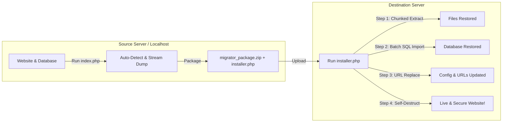

<div align="center">

# 📦 Website Migrator & Site Cloner

**Universal 1-Click Website & Database Migration Tool for Shared Hosting, cPanel, & Localhost.**

[](LICENSE)
[](https://php.net)
[](SECURITY.md)
[](https://github.com/kazuhamoe/Website-Migrator)

<br/>

**[English](README.md)** &bull; **[Bahasa Indonesia](README.id.md)**

<p align="center">
  A lightweight, transparent, zero-dependency PHP tool to clone and migrate entire websites and MySQL databases between servers without timeouts, memory limits, or third-party plugin lock-in.
</p>

</div>

---

## 🚀 Why Website Migrator?

Migrating a website between hosting providers or moving from localhost (XAMPP/Laragon) to live cPanel often causes headaches:
- **Shared Hosting Timeout Limits:** Standard import scripts crash when `max_execution_time` (30s) is exceeded.
- **Corrupted WordPress Settings:** Naive search-and-replace breaks serialized PHP objects (`s:length:"value";`) in `wp_options`.
- **Heavy Third-Party Plugins:** Many migration plugins demand paid subscriptions, limit backup sizes to 512MB, or require huge server resources.

**Website Migrator** solves all of this with a clean two-part workflow:
1. **Packager (`index.php` on Source Server):** Auto-detects your CMS/framework, streams MySQL dumps row-by-row, strips unnecessary cache/logs, and bundles everything into an archive.
2. **Standalone Installer (`installer.php` on Target Server):** A 100% self-contained single file that extracts ZIP in chunks, restores SQL in batches via AJAX (preventing timeouts), performs deep serialized-safe search-and-replace, and self-destructs after completion.

---

## ✨ Key Features

- ⚡ **Auto-Detection:** Automatically discovers database credentials for **WordPress** (`wp-config.php`), **Laravel** (`.env`), **CodeIgniter 3/4**, and generic PHP projects.
- 💾 **Streaming MySQL Dumper:** Exports large MySQL tables line-by-line via PDO without exhausting server RAM.
- 🔄 **Chunked Resumable Restorer:** Restores database dumps in small AJAX batches with byte-offset tracking, bypassing shared hosting execution timeouts.
- 🧩 **Serialized String Length Recalculation:** Safely replaces old domain URLs inside PHP serialized strings without breaking WordPress themes, widgets, or plugins.
- 🛡️ **Smart Exclude Filter:** Excludes junk files (`node_modules`, `.git`, `.idea`, `cache`, error logs) for compact archive sizes.
- 📦 **1-File Standalone Installer:** `installer.php` requires zero external CSS, JS, or frameworks on the destination server.
- 🔥 **Self-Destruct Cleanup:** 1-click button cleans up `installer.php` and backup archives after deployment to maintain server security.
- 🎨 **SaaS Dark Glassmorphic UI:** Built with sleek responsive glassmorphism, realtime progress bars, and monospace terminal logs.

---

## 🏗️ How It Works (Workflow)



---

## 📖 Quickstart Guide

### 1. On the Source Server / Localhost:
1. Place this folder into your web directory (e.g. `C:\xampp\htdocs\Website-Migrator` or your live site's directory).
2. Open your browser and navigate to `http://localhost/Website-Migrator/index.php`.
3. Check the auto-detected settings and database credentials.
4. Click **🚀 Mulai Pemaketan (Export)**.
5. Once completed, download `migrator_package.zip` and `installer.php`.

### 2. On the Destination Server / Hosting:
1. Upload `migrator_package.zip` and `installer.php` to your new hosting root directory (e.g. `public_html/`).
2. Open your browser: `https://your-new-domain.com/installer.php`.
3. Fill in your new MySQL database credentials and target domain.
4. Click **🚀 Mulai Pemulihan (Restore Website)**.
5. Once restored, click **🔒 Hapus Berkas Migrator (Self-Destruct)** to clean up the installer and backup archive.

---

## 🛡️ Transparency & Anti-Malware Statement

> [!IMPORTANT]
> **This tool is 100% clean and transparent open-source software.**
> - Contains **NO** backdoors, web shells, or obfuscated payloads.
> - Collects **NO** telemetry or analytics. All operations stay strictly local.
> - Always remember to use the **Self-Destruct** button after migration so no installer files remain accessible.
> - Read our full [SECURITY.md](SECURITY.md) policy for detailed specifications.

---

## 🧪 Testing

Run the automated PHP test suite locally:
```bash
php tests/run_tests.php
```

---

## 📄 License

This project is licensed under the [MIT License](LICENSE).  
Created and maintained with ❤️ by [kazuhamoe](https://github.com/kazuhamoe).
